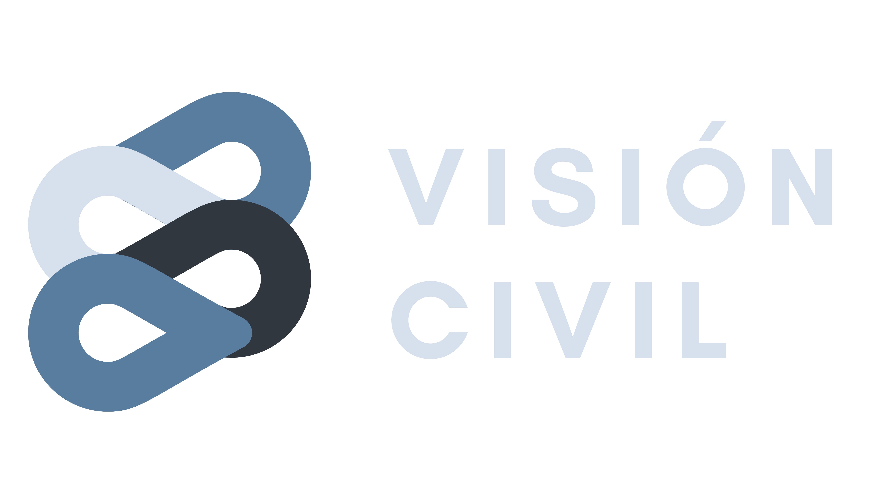

# **Visión Civil**

  

Visión Civil is a Crime Management System which focuses on preventing crime in the municipality of Sibaté, Colombia. The system works with a mobile app that is meant to be used by the citizens and the police, and a web app that is meant to be used by the government functionaries.

## **Visión Civil Mobile**
The technical details on the Mobile app can be found on [the mobile app repo section](App/)

### **Mobile app users description**
> Keep in mind that the mobile app user interface is not the same for the citizens and the policemans. The same mobile app is use for both users.

#### **The citizen**
The citizen that downloads the app needs to sign up in order to use the following services. Once the citizen creates an account he is now able to use 3 functionalities:
1. Report crimes that he witnesses
2. Notify his confidence contacts when he thinks he is in danger
3. Select his confidence contacts
Besides this 3 main functionalities, the citizen is also able to login, logout, view his profile information and manage it.

#### **The policeman**
The policeman that downloads the app needs to be previously registered on the system by a master functionary in order to use the following services. Once the policeman is registered by a master functionary he is now able to use 7 functionalities:
1. View crime reports made by the citizens on the app
2. Select a report and take it in order to take care of it
3. View the information of the currently taked report
4. End the currently taked report in order to appear again as a available policeman on the web app
5. Notify that he has just started his work journey in order to evidenciate that he is in service
6. Notify that he has just ended his work journey in order to evidenciate that he is not in service
7. Eliminate duplicate and/or false reports made by the citizens

## **Visión Civil Web**
The technical details on the web app can be found on [the web app repo section](WebPage/)

### **Web app users description**

#### **The functionary**
The functionary that wants to use the web app needs to be previously registered on the system by a master functionary in order to use the following services. Once the functionary is registered by a master functionary he is now able to use 4 functionalities:
1. View all the crime stats on a dashboard
2. View a list of all the generated reports by the citizens in real time
3. Send notifications to all the citizens that have the mobile app installed (The notifications will appear to them as OS native notifications)
4. Manage users (Add, delete, modify and view users)
Beside this 5 main functionalities, the functionary is able to login, logout and change it's password.
> Keep in mind that only the master functionaries are able to manage users
> Keep also in mind that when the software is going to be released to production we will create a genesis functionary that will start to add the other users to the system.

